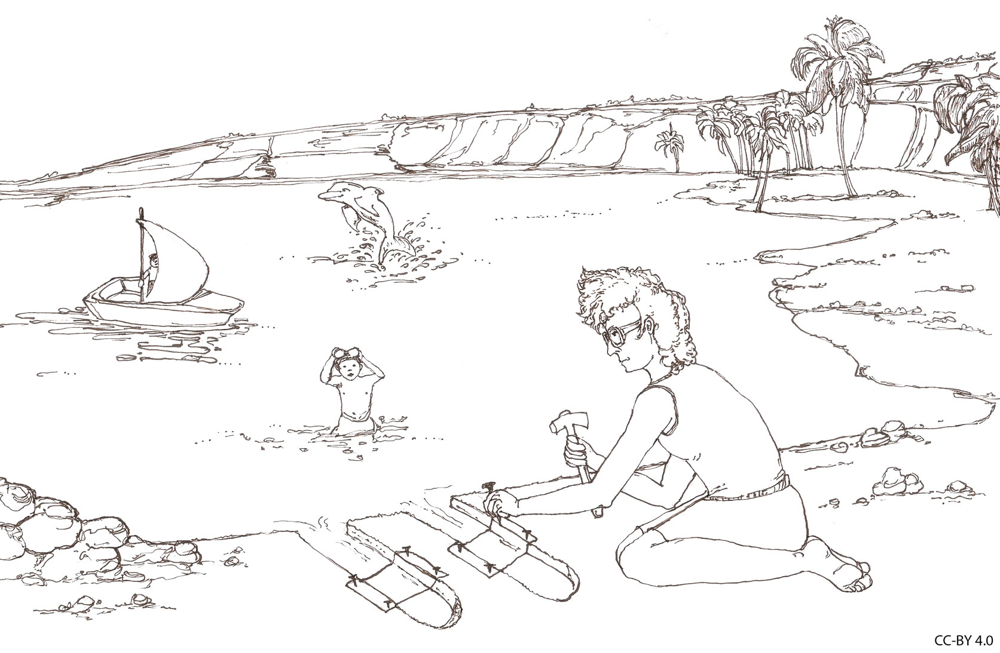

# Psychologia muzyki i muzykoterapia

## Analogia Bregmana

Wyobraź sobie, że jesteś nad jeziorem i twój kolega chce zagrać z tobą w grę. Gra polega na tym: wykopiecie dwa wąskie "kanały" idące z jeziora w głąb lądu. Wystarczy, żeby kanały miały metr długości, kilkanaście centymetrów szerokości i były od siebie odległe o jakieś pół metra. W połowie każdego z tych kanałów rozciągniecie prostokątny kawałek tkaniny i przymocujecie do ścian waszych kanałów. Gdy na jeziorze powstają fale, wpływają do waszych kanałów i powodują ruch tkaniny.

## Analogia Bregmana

## Na czym polega gra?

Twoim zadaniem jest patrzeć **tylko na ruch tkaniny** i odpowiedzieć na serię pytań:

- Ile łódek pływa po jeziorze?
- Gdzie są te łódki?
- Która z łódek ma największy silnik?
- Która jest najbliżej ciebie?
- Czy wieje wiatr?
- Czy ktoś nagle wrzucił do jeziora jakiś duży obiekt?

## Co?

- Rozwiązanie tego problemu wydaje się niemożliwe
- Jest to **ścisła analogia** problemów rozwiązywanych przez ludzki system słuchowy
