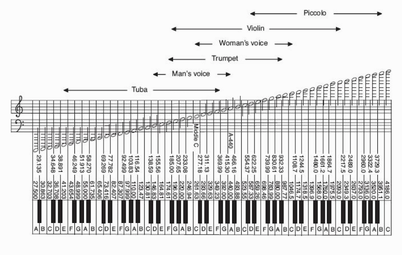
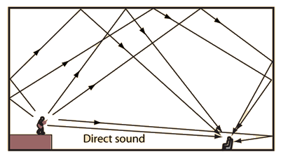

# Podstawowe elementy muzyki

## Co to jest muzyka?

_Ciąg dźwięków śpiewanych lub granych na instrumentach, tworzących pewną kompozycyjną całość; też: sztuka układania i wykonywania takich kompozycji (Słownik Języka Polskiego)_

## Co to jest muzyka?

_Art concerned with combining vocal or instrumental sounds for beauty of form or emotional expression, usually according to cultural standards of rhythm, melody, and, in most Western music, harmony. Both the simple folk song and the complex electronic composition belong to the same activity, music. Both are humanly engineered; both are conceptual and auditory, and these factors have been present in music of all styles and in all periods of history, throughout the world (Encyclopedia Britannica)_

## Co to jest muzyka?

_Art form whose medium is sound (Wikipedia)_

## Wysokość dźwięku

- Właściwość dźwięku odbierana przez nasze umysły, _mająca związek_ z częstotliwością fali akustycznej
- Nasz narząd słuchu odbiera bodźce o różnych częstotliwościach
- Jeśli częstotliwości są ułożone w pewnym stopniu **harmonicznie** (są wielokrotnościami jakiejś częstotliwości podstawowej), nasze umysły odbierają taki dźwięk jako posiadający wysokość

## Wysokość dźwięku

- W zachodnioeuropejskiej tradycji muzycznej najczęściej wysokość dźwięku oznacza się za pomocą nut oznaczających wysokości dźwięku w systemie równomiernie temperowanym, gdzie dźwięk **A razkreślne ma fundamentalną składową 440Hz** (norma ISO 16:1975)
- Dźwięk o dwukrotnie wyższej fundamentalnej częstotliwości będzie oddalony o **oktawę** w górę
- W obrębie oktawy mieści się dwanaście tonów chromatycznych - tak też podzielona jest klawiatura fortepianu

## Wysokość dźwięku

## Rytm

- Rozmieszczenie dźwięków w czasie
- Np. w _Sto lat!_ mamy pięć dźwięków dłuższych (_sto lat sto lat niech..._), cztery dwa razy krótsze (_ży-je ży-je_) i na koniec jeden dłższy (_...naaaam!_)
- Najczęściej to rozmieszczenie jest w jakiś sposób regularne

## Tempo

- Jak szybki jest dany utwór
- Jeśli tupiesz nogą, jak szybko to robisz
- Tempo mierzy się w muzyce za pomocą BPM (_beats per minute_) albo określeń klasycznych (_largo, moderato, allegro, presto..._)
- Bardzo proste pojęcie, jednak sprawiające ogromne kłopoty badaczom

## Kontur

- Czy dźwięki następujące po sobie _unoszą się_ (w sensie wysokości) czy _opadają_
- Mówiąc o konturze nie analizujemy tego **jak bardzo** (o jaki interwał) unoszą się bądź opadają

## Barwa

- _Charakter_ dźwięku, to co sprawia, że rozróżniamy różne instrumenty (albo różnych ludzi po głosie)
- Nie do końca wiadomo czym jest barwa
- Definicja ASA: _"that attribute of auditory sensation which enables a listener to judge that two nonidentical sounds, similarly presented and having the same loudness and pitch, are dissimilar. Timbre depends primarily upon the frequency spectrum, although it also depends upon the sound pressure and the temporal characteristics of the sound"_

## Głośność

- Odczucie związane z amplitudą fali akustycznej, ale nie dokładnie i nie wprost (będziemy o tym mówić)
- Ludzki słuch ma olbrzymi **zakres dynamiki**: nagłośniejszy bodziec jaki możemy usłyszeć jest **trylion razy (10^12) głośniejszy** niż najcichszy
- Skala logarytmiczna, decybele - 0dB to próg słyszenia, każde +20dB to wzrost o jeden rząd wielkości

## Pogłos, otoczenie akustyczne

## Pogłos, otoczenie akustyczne

- Fala akustyczna dociera do nas nie tylko wprost od źródła, ale też najczęściej odbija się od obiektów w otoczeniu
- Od każdego obiektu odbija się w inny sposób
- Nasze mózgi potrafią rozpoznawać te informacje i na tej podstawie wnosić o otoczeniu akustycznym
- Levitin mówi, że pogłos ma duże znaczenie dla tego, czy dźwięk instrumentu wydaje nam się przyjemny

# Właściwości wyższego rzędu

## Melodia

- Ułożenie dźwięków w czasie
- O melodii nie decyduje bezwzględna częstotliwość dźwięku a raczej różnice względne pomiędzy poszczególnymi dźwiękami - interwały

## Metrum

- Odzwierciedla regularności w rytmie
- Decydują proporcje pomiędzy _mocniejszymi_ (głośniejszymi) a _słabszymi_ (cichszymi) dźwiękami, ale nie tylko
- Np. walc ma metrum 3/4, marsz 2/4, muzyka rockowa, hip-hop, rnb 4/4, blues shuffle 12/8, jazz swing 4/4 synkopowany

## Tonacja, centrum tonalne

- Zwłaszcza w tradycji zachodnioeuropejskiej - jeden dźwięk do którego _zmierza_ kompozycja
- Również podział na tonacje durowe (wesołe?) i molowe (smutne?)
- Duża rola czynników kulturowych w kojarzeniu emocji z tonacją (będziemy o tym mówić)

## Harmonia

- Obecność **akordów** i ich progresja
- Akord to co najmniej dwa dźwięki zagrane razem
