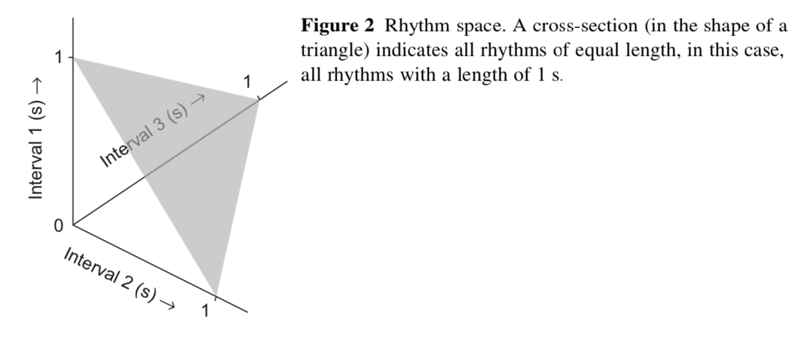
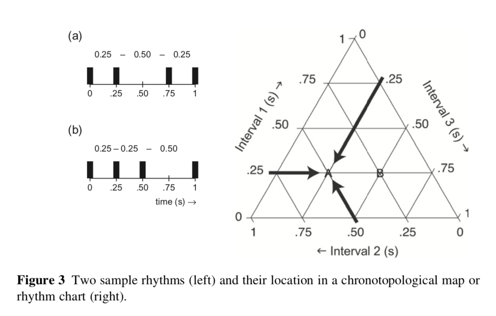

# Składniki rytmu

## Wzorzec rytmiczny (_rhythmic pattern_)

- Wzorzec tego "co się powtarza"
- W muzyce tożsamy z pojęciem _rytmu_
- Można z grubsza zapisać go w nutach

## Struktura metryczna

- Sposób, w jaki słuchacz nadaje wzorcowi rytmicznemu regularność
- Powiązany z metrum w muzyce
- Beat
- Indukcja beat'u (_beat induction_) - proces, w którym ze skomplikowanego rytmu wyciągamy beat

## Metrum

- 2/4
- 3/4
- 4/4

## Metrum

- 6/8
- 5/4
- 7/4

## Tempo

- Jak szybki jest beat?
- Problematyczne pojęcie, bo w prawdziwej muzyce nie do końca wiemy jak nadawać tempo
- Przyjmuje się, że tempa w muzyce współczesnej oscylują wokół 80-150 bpm

## (Micro)timing

- Niuanse, wrażenie grania 'do tyłu', rytmu 'spiętego' itd.
- Sprowadza się do delikatnych opóźnień/przyspieszeń niektórych dźwięków w rytmie

## (Micro)timing

- Bardzo ciekawe zjawisko, wiele pytań badawczych
- Skąd wiemy, że przesunięte wartości tworzą ten sam rytm?
- O ile możemy przesunąć, żeby uniknąć wrażenia _nierówności_
- Dlaczego niektóre przesunięcia są fajniejsze niż inne

## Przestrzeń wszystkich rytmów (4 dźwięki)

## Mapy chronotopologiczne

