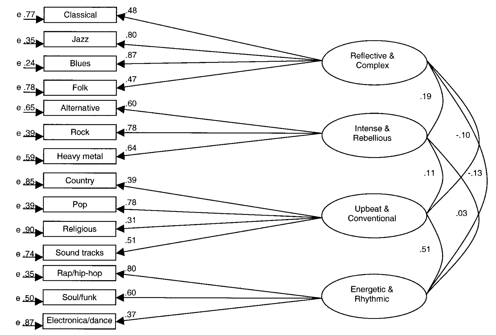
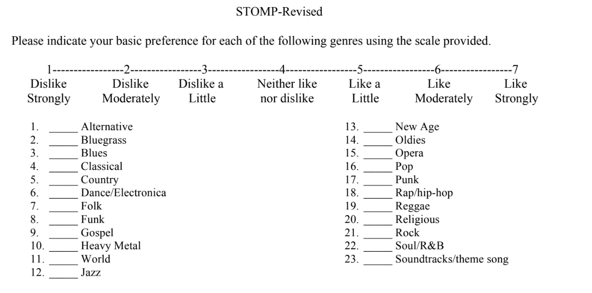

# Preferencje muzyczne

## Rentfrow & Gosling, 2003

- Preferencje muzyczne to różnice indywidualne w afektywnych odpowiedziach na muzykę
- Stanowią zestaw względnie stałych cech
- Mają strukturę czynnikową 

## Rentfrow & Gosling, 2003

## Kwestionariusz STOMP-R

## Problemy tego ujęcia

- Zależność od gatunku
- Trafność międzykulturowa

## Model MUSIC

- Rentfrow, Goldberg, Stillwell, Kosinski, Gosling, Levitin (2011, 2012)
- Metodologia niezależna od podziałów gatunkowych
- Pięć czynników: _Mellow, Unpretentious, Sophisticated, Intense, Contemporary_

## Preferencje atrybutów muzycznych (Greenberg et al, 2016)

- Chodzi o **atrybuty muzyczne**
- Trzy czynniki: _Arousal, Depth, Valence_
